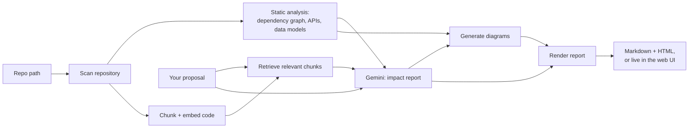

# WIP: Draft version of README.md

<div align="center">

# Architecture Reviewer

**AI-powered architecture impact analysis for your codebase — running entirely on free-tier infrastructure.**

Point it at a repo, describe a feature in plain English, and get back the affected APIs,
database changes, new components, scalability risks, security concerns, and a set of
Mermaid diagrams — via a CLI or a local web UI.

[](https://nodejs.org)
[](https://www.typescriptlang.org)
[](https://ai.google.dev)
[](#testing)
[](LICENSE)
[](docs/SETUP.md)

</div>

---

## Contents

- [Why this exists](#why-this-exists)
- [Features](#features)
- [How it works](#how-it-works)
- [Tech stack](#tech-stack)
- [Getting started](#getting-started)
- [Usage — CLI](#usage--cli)
- [Usage — Web UI](#usage--web-ui)
- [Example output](#example-output)
- [Project structure](#project-structure)
- [Configuration](#configuration)
- [Testing](#testing)
- [Troubleshooting](#troubleshooting)
- [Scope & limitations](#scope--limitations)
- [Documentation](#documentation)
- [Roadmap](#roadmap)
- [License](#license)

---

## Why this exists

Adding a feature to an existing codebase always raises the same questions: *what does this
actually touch?* Which services, which APIs, which tables — and what could go wrong at scale
or from a security standpoint? Answering that usually means manually tracing imports, grepping
for routes, and reading a lot of code before writing a single line.

This tool automates that first pass. It statically analyzes the repo, retrieves the code most
relevant to your proposed change, and asks Gemini to reason over both — producing a structured
report instead of a wall of prose, plus diagrams you can drop straight into a design doc.

It was deliberately built with **zero budget and no heavy local infrastructure** in mind: no
paid APIs, no Docker, no GPU, no hosted vector or graph database. Just Node.js, a free Gemini
API key, and a SQLite file.

## Features

- **Repository analysis** — file-tree walk respecting `.gitignore`, project-type detection (Node/Python/mixed)
- **Dependency graph** — internal import graph + external package edges for JS/TS, built on the TypeScript compiler API (`ts-morph`)
- **API inventory** — detects Express, Fastify, and Koa-style route registrations
- **Data model inventory** — detects Prisma, Mongoose, TypeORM, Sequelize models, and raw SQL `CREATE TABLE` statements
- **Retrieval-augmented reasoning** — embeds the codebase locally (no vector-DB server) and retrieves the chunks most relevant to your proposal before asking Gemini
- **Structured impact report** — affected components, affected APIs, database changes, new components, scalability risks, and security concerns, each schema-validated before it reaches you
- **Architecture diagrams** — current architecture, proposed architecture (new/affected parts highlighted), a sequence diagram of the new flow, and an ER diagram when the database changes
- **Two ways to run it** — a scriptable CLI, or a local web UI with live progress and the report rendered in the browser
- **Resilient by default** — automatic retry with backoff on rate limits, transient network failures, and server-side hiccups, tuned against a real free-tier account

## How it works



1. **Ingest** — walk the repo, respecting `.gitignore`
2. **Analyze** — build the dependency graph, API inventory, and data-model inventory (JS/TS)
3. **Retrieve** — embed the codebase and pull the chunks most relevant to your proposal (cosine similarity, no vector-DB server)
4. **Reason** — send the proposal + retrieved context + inventory to Gemini for a structured, schema-validated impact report
5. **Diagram** — turn the inventory and the report into Mermaid diagrams
6. **Report** — a Markdown file, a standalone HTML viewer, or live in the web UI

## Tech stack

| Concern | Choice | Why |
|---|---|---|
| Language / runtime | TypeScript + Node.js | Strong AST tooling for JS/TS repos, one runtime for the CLI and the web UI |
| LLM | Google Gemini (`gemini-3.6-flash`) | Free tier, fast, strong enough for structured reasoning over retrieved context |
| Embeddings | Gemini `gemini-embedding-001` | Free tier — no local embedding model, no GPU |
| Vector store | `better-sqlite3` + in-process cosine similarity | A repo's chunk count doesn't need a real vector database |
| Dependency graph | `ts-morph` (TypeScript compiler API) | No Neo4j/graph-DB server needed for a repo-sized graph |
| Diagrams | Mermaid, rendered via CDN | No headless browser or rendering server; renders natively on GitHub too |
| CLI | `commander` | Minimal, no framework overhead |
| Web UI | `express` + hand-written HTML/CSS/vanilla JS | No bundler needed for a single-user local tool |
| Validation | `zod` | Fails loudly on a malformed LLM response instead of corrupting the report |

Full rationale in [docs/ARCHITECTURE.md](docs/ARCHITECTURE.md).

## Getting started

**Prerequisites:** Node.js 20.11+ and a free [Gemini API key](https://aistudio.google.com/apikey).

```bash
git clone <this-repo>
cd Software_Arch_Reviewer_AI
npm install
npm run dev -- init          # creates .env from .env.example
```

Open `.env` and set your key:

```
GEMINI_API_KEY=your_key_here
```

That's it — no other setup, no database to provision, no billing to configure.

## Usage — CLI

```bash
npm run dev -- analyze \
  --repo <path-to-a-local-codebase> \
  --proposal "Add real-time chat between users, backed by WebSockets" \
  --out ./output
```

| Flag | Required | Description |
|---|---|---|
| `-r, --repo <path>` | yes | **Local** path to the codebase to analyze (see [note below](#a-note-on-repo-input)) |
| `-p, --proposal <text>` | yes | Plain-English description of the feature/change to evaluate |
| `-o, --out <dir>` | no | Output directory for the report (default `./output`) |

This writes `report.md` (renders natively on GitHub/VS Code) and a standalone `report.html`
(open it directly in a browser — diagrams render via `mermaid.js` from a CDN, no build step).

#### A note on repo input

The `--repo` flag takes a **local folder**, not a GitHub URL — this tool doesn't fetch remote
repos yet (see [Roadmap](#roadmap)). To analyze a GitHub project, clone it first:

```bash
git clone https://github.com/<user>/<repo>.git
npm run dev -- analyze --repo ./repo --proposal "..." --out ./output
```

## Usage — Web UI

```bash
npm run web
```

Then open **http://localhost:4317**. Fill in the repository path and your proposed change,
and watch live progress as it runs through each pipeline stage — the finished report (tables,
severity-tagged risk lists, collapsible diagrams) renders directly on the page.

```
┌─────────────────────────┬──────────────────────────────────────────┐
│  Run an analysis         │  Impact report                          │
│                          │                                          │
│  Repository path         │  Summary                                │
│  [ /path/to/project    ] │  Adding rate limiting requires...        │
│                          │                                          │
│  Proposed change         │  Affected components   Affected APIs     │
│  [                     ] │  ┌───────────────────┐ ┌───────────────┐ │
│  [                     ] │  │ ...               │ │ ...           │ │
│                          │  └───────────────────┘ └───────────────┘ │
│  [ Analyze architecture ]│                                          │
│                          │  ▸ Scalability risks   [MEDIUM] [HIGH]   │
│  ● Scanning repository   │  ▸ Security concerns   [MEDIUM]          │
│  ● Analyzing deps & APIs │                                          │
│  ○ Embedding chunks      │  ▸ Diagrams (Mermaid, collapsible)       │
└─────────────────────────┴──────────────────────────────────────────┘
```

Pass a custom port with `npm run web -- --port 8080`. Reports triggered from the web UI are
also written to disk under `.arch-review-web-output/` for anyone who wants the raw files.

## Example output

Real output from analyzing a small fixture repo (an Express + Fastify service) with the proposal
*"Add rate limiting middleware to all API routes"*:

> **Summary**
> Adding rate limiting middleware across the application requires updating both the Express
> (`src/server.js`) and Fastify (`src/fastify-server.js`) servers. Because two different web
> frameworks are used, separate rate limiting implementations or plugins backed by a shared
> datastore (e.g., Redis) will be necessary to enforce consistent request limits across all
> API endpoints.

| Scalability risk | Severity | Mitigation |
|---|---|---|
| In-memory rate limiting state won't sync across horizontally scaled instances | **High** | Use an external store such as Redis as the backing store for rate-limit counts |
| Increased latency if the rate-limit store connection is slow | **Medium** | Connection pooling, keep-alive, timeouts with fallback behavior |

| Security concern | Severity | Mitigation |
|---|---|---|
| Clients could bypass IP-based limiting via spoofed proxy headers | **High** | Configure `trust proxy` correctly in both Express and Fastify behind trusted load balancers |
| Unauthenticated `POST /users` vulnerable to resource exhaustion | **Medium** | Apply stricter limits to write/mutation routes than read routes |

Plus a Mermaid sequence diagram of the new request flow and a proposed-architecture diagram
with the new rate-limiter module highlighted — both rendered inline in the actual report.

## Project structure

```
src/
├── ingestion/         Repo walking, file classification, chunking
├── dependency-graph/  ts-morph-based import graph, API + data-model extraction
├── config/            Env/config loading, shared Gemini retry policy
├── rag/               Embeddings + local SQLite vector store
├── llm/               Gemini prompt construction + schema-validated parsing
├── diagrams/          Mermaid generation (flowchart, sequence, ER)
├── report/            Markdown + standalone HTML rendering
├── cli/               Command wiring + pipeline orchestration (runAnalyze)
├── web/               Express server (SSE) + the web UI frontend
└── types/             Shared contracts every module reads/writes

docs/
├── ARCHITECTURE.md       Design rationale + exact module contracts
├── IMPLEMENTATION_PLAN.md  Phase-by-phase build status
└── SETUP.md              Install, configure, run, troubleshoot
```

## Configuration

All configuration is environment variables, loaded from `.env` (see `.env.example`).

| Variable | Required | Default | Notes |
|---|---|---|---|
| `GEMINI_API_KEY` | yes | — | Free at [aistudio.google.com/apikey](https://aistudio.google.com/apikey) |
| `GEMINI_MODEL` | no | `gemini-3.6-flash` | Override if this model is retired — see [Troubleshooting](#troubleshooting) |
| `GEMINI_EMBEDDING_MODEL` | no | `gemini-embedding-001` | Same caveat as above |

## Testing

```bash
npm test
```

89 tests across every module. No test ever calls the live Gemini API — a `vitest.setup.ts`
hook stubs global `fetch` to throw by default, so a test that forgets to mock the client fails
loudly instead of silently burning free-tier quota (or hanging in CI, where no key is present).

## Troubleshooting

**`404 ... is not found for API version v1beta`** — Google periodically retires model ids.
List what your key currently has access to and update `.env`:

```bash
curl "https://generativelanguage.googleapis.com/v1beta/models?key=$GEMINI_API_KEY"
```

**`429 Too Many Requests` / a wall of retry warnings** — the free embedding tier can be tight.
This is expected and handled: requests are paced and retried with backoff automatically; a
large repo will just take longer. Full details in [docs/SETUP.md](docs/SETUP.md).

## Scope & limitations

- **Dependency-graph / API / data-model extraction is JavaScript/TypeScript-only.** Other
  languages are still ingested and embedded for RAG context (so Gemini can reason about them),
  but don't contribute nodes to the dependency graph. See [ARCHITECTURE.md](docs/ARCHITECTURE.md#mvp-language-scope).
- **Local repos only** — no GitHub URL ingestion yet (clone first).
- **Single-user, local tool** — the web server has no auth, queueing, or multi-tenant isolation;
  it's designed to run on your own machine, not to be exposed publicly.

## Documentation

- [docs/ARCHITECTURE.md](docs/ARCHITECTURE.md) — design rationale and every module's exact contract
- [docs/IMPLEMENTATION_PLAN.md](docs/IMPLEMENTATION_PLAN.md) — phase-by-phase status
- [docs/SETUP.md](docs/SETUP.md) — install, configure, run, troubleshoot

## Roadmap

- [ ] Language plugins for Python/Go/Java dependency graphs
- [ ] Ingest a remote GitHub repo by URL directly (no local clone step)
- [ ] PR-comment bot mode (post the report to a GitHub PR via the `gh` CLI)
- [ ] Incremental re-analysis (only re-embed files changed since the last run)
- [ ] Nested `.gitignore` support (currently root-level only)

## License

[MIT](LICENSE)
