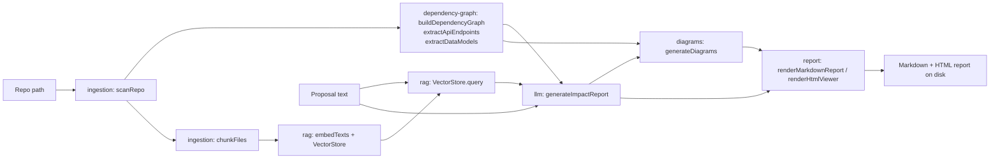

# WIP: Draft version of ARCHITECTURE.md

# Architecture

## Goal

Given (1) a path to an existing codebase and (2) a natural-language description of a
proposed feature/change, produce a report that explains: which existing components,
APIs, and database structures are affected; what new components are likely needed;
scalability risks; security concerns; and a set of Mermaid diagrams (current
architecture, proposed architecture, and the new feature's sequence flow).

## Constraints that shaped every decision

- **$0 budget.** Only free-tier services are used: Google Gemini (generous free
  quota for `gemini-3.6-flash` and the `gemini-embedding-001` embedding model).
- **No heavy local resources.** No Docker, no local LLM/GPU inference, no hosted
  vector database, no graph database server. Everything runs as a single Node.js
  CLI process on a normal laptop.
- **Stack is not fixed** — chosen for fit, not because it was prescribed.

## Stack

| Concern | Choice | Why |
|---|---|---|
| Language/runtime | TypeScript + Node.js | Great AST tooling for JS/TS repos, single runtime for CLI + future web UI, no compiled-binary distribution needed |
| LLM | Google Gemini (`gemini-3.6-flash`) | Free tier, fast, strong enough for structured reasoning over retrieved context |
| Embeddings | Gemini `gemini-embedding-001` | Free tier, avoids running any local embedding model. This model only supports single-item `embedContent` (no synchronous batch endpoint), so `embedTexts`'s batch call always falls back to its per-item path — expected, see `src/rag/embed.ts` |
| Vector store | `better-sqlite3` (local file) + in-process cosine similarity | A repo's chunk count (hundreds–low thousands) makes brute-force cosine similarity in JS fast enough; avoids standing up Pinecone/Weaviate/Qdrant |
| Dependency graph | In-memory graph built with `ts-morph` (wraps the TS compiler API) | No Neo4j/graph-DB server; the graph is small enough to hold as plain objects and export to Mermaid |
| Diagrams | Mermaid text, rendered via a self-contained HTML file that loads `mermaid.js` from a CDN | No diagram-rendering server or headless browser needed; the `.md` renders natively on GitHub/VS Code and the `.html` renders standalone in any browser |
| CLI | `commander` | Minimal, no framework overhead |
| Web UI | `express` (server) + hand-written HTML/CSS/vanilla JS (frontend), no bundler | A local single-user tool doesn't need React/webpack; `express.static` + one SSE route is the whole server. Reuses `runAnalyze` directly — no separate pipeline for the web path |
| Config | `dotenv` + `zod`-validated LLM output | Keep the only "credential" a single API key; validate the LLM's JSON so a bad response fails loudly instead of corrupting the report |

## MVP language scope

Dependency-graph/API/DB extraction is implemented for **JavaScript/TypeScript**
repositories (the `ts-morph`-based static analysis). Files in other languages are
still ingested and embedded for RAG context (so the LLM can reason about them), but
they don't contribute nodes/edges to the dependency graph or the API/data-model
inventories. This is a deliberate MVP scope cut, documented so it's an explicit
decision, not a hidden gap — see "Future Work" in
[IMPLEMENTATION_PLAN.md](./IMPLEMENTATION_PLAN.md) for the plugin-interface path to
add Python/Go/etc.

## Data flow



## Module contracts

All shared shapes live in [`src/types/index.ts`](../src/types/index.ts) — every
module reads/writes these types. The exact function signatures each module must
export:

### `src/ingestion`
```ts
scanRepo(rootPath: string): Promise<RepoInventory>
chunkFiles(inventory: RepoInventory, maxLines?: number): CodeChunk[]
```
- `scanRepo` walks the repo respecting `.gitignore` (via the `ignore` package) plus
  a hard-coded skip list (`node_modules`, `.git`, `dist`, `build`, lockfiles),
  classifies each file's `Language` by extension, and detects `projectType` from
  manifest files present (`package.json` → node, `requirements.txt`/`pyproject.toml`
  → python, both → mixed).
- `chunkFiles` splits each file's content into `CHUNK_MAX_LINES`-line windows
  (from `src/config`), producing stable ids like `"src/foo.ts:1-120"`.

### `src/dependency-graph`
```ts
buildDependencyGraph(inventory: RepoInventory): Promise<DependencyGraph>
extractApiEndpoints(inventory: RepoInventory): Promise<ApiEndpoint[]>
extractDataModels(inventory: RepoInventory): Promise<DataModel[]>
```
- `buildDependencyGraph`: use `ts-morph` to load all JS/TS files in the inventory,
  walk import declarations/`require()` calls, resolve relative specifiers to
  in-repo files (edge `kind: 'import'`) and leave bare specifiers as external
  package names (edge `kind: 'external'`).
- `extractApiEndpoints`: regex/AST scan for Express/Fastify/Koa-style route
  registrations (`app.get(...)`, `router.post(...)`, `fastify.route(...)`, etc.).
  Best-effort — false negatives on exotic routing setups are acceptable for v1.
- `extractDataModels`: detect common ORM model definitions (Prisma schema blocks,
  Mongoose `Schema(...)`, TypeORM `@Entity()` classes, Sequelize `.define(...)`)
  and raw `CREATE TABLE` statements in `.sql` files.

### `src/config/gemini-retry.ts`
```ts
withGeminiRetry<T>(fn: () => Promise<T>, label: string): Promise<T>
isRetryableGeminiError(err: unknown): boolean
```
Shared by `src/rag` and `src/llm` — any direct call through
`@google/generative-ai` should go through this. Discovered by running the tool
against a real repo with a real free-tier key: three failure modes showed up
that a single try cannot survive, and all three are transient rather than a
property of the request: an HTTP 429 (free-tier embedding quota can be tight
enough that even modest concurrency trips it), an HTTP 5xx (e.g. a live 503
"currently experiencing high demand" from `gemini-flash-latest`), and a bare
`GoogleGenerativeAIError` (the SDK's wrapper when the underlying `fetch()`
itself fails — DNS hiccup, TCP reset, timeout — before any HTTP response
comes back). All three are retried with exponential backoff + jitter; anything
else (a non-429/5xx `GoogleGenerativeAIFetchError`, a validation error) is
rethrown immediately since retrying it would just fail the same way again.
Also note: Google periodically retires model ids outright (this project has
hit that twice during development — see `docs/SETUP.md`'s troubleshooting
section) — a retry can't fix a 404 for a dead model id, only picking a live one can.

### `src/rag`
```ts
embedTexts(texts: string[]): Promise<number[][]>
class VectorStore {
  init(dbPath: string): void
  upsertChunks(chunks: CodeChunk[]): Promise<void>
  query(queryText: string, k?: number): Promise<RetrievalResult[]>
  close(): void
}
```
- `embedTexts` calls the Gemini embedding model in batches (through
  `withGeminiRetry`); must not throw on a single bad chunk — skip and log
  instead so one malformed file doesn't kill a run. Note: `gemini-embedding-001`
  (the default embedding model) doesn't support a synchronous batch endpoint,
  so the batch call always falls through to the per-item path — expected, not
  a bug.
- `VectorStore` persists chunks + their embeddings (embedding stored as a JSON
  array blob) in a `better-sqlite3` table under `.arch-review-cache/` (see
  `CACHE_DIR` in `src/config`), keyed by chunk `id`, so re-running on the same repo
  doesn't re-embed unchanged files. `query` embeds the query text, computes cosine
  similarity in JS against all stored rows, and returns the top `k`
  (`RAG_TOP_K` default).

### `src/llm`
```ts
generateImpactReport(params: {
  proposal: ChangeProposal
  inventory: ArchitectureInventory
  retrievedContext: RetrievalResult[]
}): Promise<ArchitectureImpactReport>
```
- Builds a single structured prompt: proposal text + a condensed summary of the
  dependency graph/API list/data models + the retrieved code chunks, and asks
  Gemini (through `withGeminiRetry`) for JSON matching `ArchitectureImpactReport`.
  Validate the response with a `zod` schema; on parse failure, retry once with a
  stricter "return only JSON" instruction before throwing.

### `src/diagrams`
```ts
generateDiagrams(inventory: ArchitectureInventory, report: ArchitectureImpactReport): DiagramSet
```
- `currentArchitecture`: a Mermaid `flowchart` built from `dependencyGraph`,
  grouping files by top-level directory as subgraphs (raw per-file graphs are too
  noisy).
- `proposedArchitecture`: the same diagram with `report.newComponents` and
  `report.affectedComponents` visually highlighted (Mermaid `class`/`style`).
- `sequenceFlow`: a Mermaid `sequenceDiagram` inferred from `report.summary` +
  `affectedApis` (client → affected API(s) → affected component(s) →
  data store, when `databaseChanges` is non-empty).
- `dataModelDiagram`: a Mermaid `erDiagram` when `report.databaseChanges` is
  non-empty; omitted otherwise.

### `src/report`
```ts
renderMarkdownReport(result: AnalysisResult): string
renderHtmlViewer(markdown: string, diagrams: DiagramSet): string
writeReportToDisk(outDir: string, markdown: string, html: string): Promise<{ mdPath: string; htmlPath: string }>
```
- The Markdown report embeds diagrams as ` ```mermaid ` fenced blocks (renders
  natively in GitHub/VS Code).
- The HTML viewer is a single self-contained file that loads `mermaid.js` from
  `cdn.jsdelivr.net` and renders the same content standalone in a browser — no
  bundler, no server.

### `src/cli`
Wires all of the above together (integration phase, not parallelized):
`arch-review analyze --repo <path> --proposal "<text>" --out <dir>` and
`arch-review init`. `runAnalyze` (in `src/cli/analyze.ts`) is the shared
orchestration function — `src/web` calls the same function, not a
reimplementation of the pipeline.

### `src/web`
```ts
createServer(options?: { runAnalyzeFn?: typeof runAnalyze }): express.Express
```
- Serves the static frontend from `src/web/public/` (`index.html`,
  `styles.css`, `app.js` — no build step, no framework).
- `GET /api/analyze?repo=<path>&proposal=<text>&out=<dir>` streams Server-Sent
  Events: one `progress` event per `runAnalyze` `onProgress` call, then either
  a `result` event (`{ result: AnalysisResult, mdPath, htmlPath }`) or a
  `failure` event (`{ message }`) — never a bare `error` event, since
  `EventSource` reserves that name for connection-level failures and a
  same-named custom event would be indistinguishable from a dropped
  connection on the client.
- A GET endpoint (not POST) is deliberate: it lets the frontend use the
  browser's native `EventSource`, which handles SSE framing/reconnection,
  instead of hand-rolling `fetch` + a `ReadableStream` reader for a
  POST-based stream.
- `runAnalyzeFn` is injectable so `server.test.ts` never triggers a real repo
  scan or Gemini call.
- `arch-review web [--port <port>]` (default 4317) starts it from the CLI.

## Testing approach

No module's tests may make live Gemini API calls (no API key is guaranteed to be
present in CI, and it would burn free-tier quota on every test run) — enforced,
not just documented, by `vitest.setup.ts` stubbing global `fetch` to throw by
default. `rag` and `llm` tests mock the Gemini client. `ingestion` and
`dependency-graph` tests run against small fixture repos checked into
`src/**/fixtures/`. `src/web/server.test.ts` uses `supertest` against
`createServer({ runAnalyzeFn: <mock> })` — no real repo scan or Gemini call.
